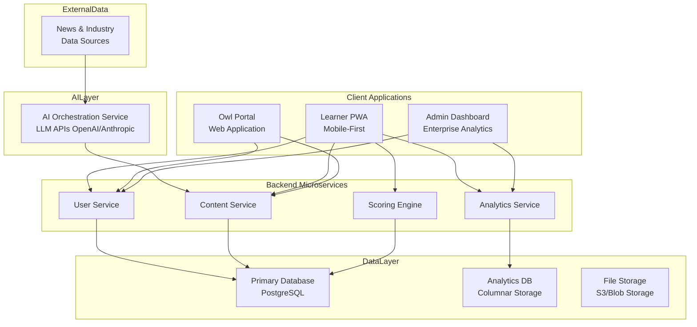

## **aijai: Platform Architecture & Data Flow**

**(This would be a single PowerPoint slide with the diagram below as the central element)**

### **Slide Title: aijai Technical Architecture: Scaling Wisdom Through AI-Augmented Human Insight**

### **Central Diagram: Component Architecture**

---

### **Key Components Explained (Bullet Points for Slide)**

**1. Learner PWA (Progressive Web App)**
- Mobile-first interface for micro-learning
- 7x7 Skills Matrix visualization
- Scenario player with rating system
- Offline capability via service workers

**2. Owl Portal (Expert Interface)**
- AI-assisted scenario creation studio
- "Mission Board" for brief management
- Impact dashboard and community features
- Real-time similarity checking

**3. Admin & Analytics Dashboard**
- Organizational intelligence heat maps
- Cohort analysis & trend reporting
- Content management system
- Tenant administration

**4. AI Orchestration Layer**
- Generates scenario briefs from news sources
- Acts as co-pilot for Owl content creation
- Powers personalization and recommendations
- Handles NLP for user onboarding

**5. Core Microservices**
- **User Service:** Authentication & profiles
- **Content Service:** Scenario & domain management
- **Scoring Engine:** Calculates alignment metrics
- **Analytics Service:** Aggregates anonymized data

**6. Data Layer**
- **PostgreSQL:** Primary transactional data
- **Columnar DB:** Analytics and reporting
- **Vector DB:** Similarity search for content deduplication
- **Blob Storage:** Rich media assets

---

### **Key Data Flows (Callouts on Diagram)**

1. **Wisdom Capture:** Owl Portal → AI Co-pilot → Content Service
2. **Learning Loop:** Learner PWA → Scoring Engine → Analytics Service  
3. **Insight Generation:** External Data → AI → Mission Board
4. **Business Intelligence:** Analytics Service → Admin Dashboard

### **Architecture Principles**
- **Multi-tenant design** with strict data isolation
- **API-first microservices** for scalability
- **AI-augmented** not AI-replaced human judgement
- **Mobile-first** PWA for learner convenience

---

This slide provides a comprehensive yet clean visual overview that would work well in an investor or technical stakeholder presentation. The Mermaid diagram clearly shows how all components interact while the bullet points provide the essential context.